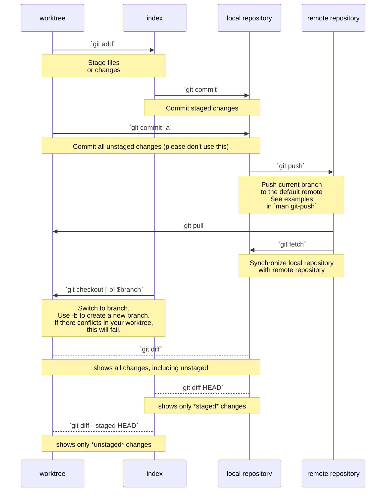

# Git CLI Commands

You may never use the Git CLI (Command Line Interface).  None the less
it is important to understand what the commands are.  Most, if not all,
Git GUIs use these commands to perform the git tasks that the GUI offers.
Knowing the basics of the CLI will make using Git GUI like VSCode easier.

## Overview

## git clone

The ***git clone*** command is used to create a local repository.  This command
needs to be run in a command prompt or terminal from the folder that is to be
the parent folder of the local repository.  

This command is used everytime to create a new local repository.  It is used
only once per local repository.  Without this command working with git would
be impossible.

> \>git clone \<remote-repository-URL\> \<folder-name\>
> 
> Example:
> \>git clone https://github.com/Star-City-Robotics/SwerveDrive-2024.git SwerveDrive

Where:
- \<remote-repository-URL\> is the link to the remote repository.  This URL
  can be obtained from the GitHub page for that repository.  It is available
  in the green button on the main page for the source code, above the
  source code directory tree.  Copy and paste the HTTPS version of the
  repository URL.
- \<folder-name\> is the name of the folder or directory that will be
  created in your current working directory.  This argument is optional.
  If it is not present, the last part of the URL without the ***.git***
  will be used as the folder name.  In the above example, the default
  foler name is ***SwerveDrive-2024***.

## git status

The ***git status*** is probably the most commonly used git command.  
It provides the status of your local repository.  It will list which files have 
been added or modified, which files have been marked for committing, 
and other useful information.

> \>git status

## git add

The ***git add*** command is used to mark a modified file or a new file so 
that it can be committed to the local repository.  Some GUI applications 
hide this command and performs it in the background when a commit is run.

> \>git add \<list of files to be committed\>
> 
> example:
> \>git add README.md doc/Doxyfile

A directory or folder cannot be added directly to a repository.  Adding and 
committing a file in the directory or folder will automatically create the 
directory or folder in the repository.

## git commit

The ***git commit*** command is how changes are stored in the local repository. 
In some SCM applications, a commit is called a checkin.  In terms of SCM, 
the two keywords mean the same thing.   With git, we use the term commit 
because it matches the git command to move changed code into the local 
repository.

The commit process takes more than running the command.  As the git commit 
command runs, an editor pops up.  You enter a descriptive and useful comment
that explains what changes were made and why.  Make sure that these comments
are meaningful to the other developers on the team.

A comment of “fixed bug” is meaningless.  It does not describe what was done 
or why.  A comment like “fixed bug ### that caused the motors to stop at 
random times.” is meaningful.

> \>git commit

**Note:** Only files marked for being commited by the ***git add*** command
will be actually be put into the local repository.

###  Selecting Commit Editor

The default editor that is used for the commit is set when Git is installed.  
This may not necessarily be the editor you want to use.  The default editor 
can be set at a later time by running the following command:

> \>git config –global core.editor \<editor-command\>

The \<editor-command\> is usually just the editor name.  It can contain options for the editor.
The editor used as the default editor must be a text1 editor that is installed on the computer 
that the local repository is on.

 ##  git push

Once changes to the source code has been verified, tested, and are working, these changes can be 
moved to the remote repository on GitHub to make them available for the rest of the programming 
team.  This is done using the git push command.

Sometimes, the push command will fail if there are conflicts with the changes.  For example, if 
two programmers change the same section of code.  The first programming to push those changes to 
the remote repository will be successful.  When the second programmer attempts to push their changes 
to the remote repository, git will not know how to add these changes.  In this case, the second 
programmer will need to resolve the merge issues manually.  The code that conflicts will be highlighted 
in the local repository by having both sets of code enclosed in 
“============”, “>>>>>>>>>>>>>>>”, and “\<\<\<\<\<\<\<\<\<\<” lines.  
Once the merger issues have been resolved, the new code can be committed to the local repository 
and then pushed to the remote repository.

> \>git push

### Authentication

Some times the git push will fail because the user is not or no longer recognized as a valid programmer 
for the remote repository.  When this happens, you need to reauthenticate yourself using the 
GitHub CLI command gh auth login from a command prompt window or a terminal on your laptop and 
the GitHub mobile app on your phone.  The gh command will tell you what to do: log into your GitHub 
Account on a browser and the browser will ask you to enter a code number into the GitHub app on your phone.

> \>gh auth login

*Note:* ***gh*** is GitHub CLI, Command Line Interface.

##  3.5  git pull
As other developers push changed code to the remote repository, your local repository becomes out 
of sync.  To restore your local repository so that you are using the latest version of the code, 
you need to fetch those changes.  The git pull command is how you make your local repository up to date.

If you have a file that is modified, git will try to merge the changes from the remote repository 
into your modified file.  If it cannot, you end up with merge issues.  Just like merge issues resulting
 from a git push, you need to manually resolve those changes locally.  The difference between a pull 
 and a push merge issue, you do not push your resolved merge issues until you are ready for your next 
 git push.

 
> \>git pull

## git branch

The ***git branch*** command is used to see what branches are available and
to create a new branch.  By defaults, the ***git branch*** command lists what
branches are available to the local repository.  To see what branches exist
in the remote repository, use the option ***--all***.

To create a new branch, place the new repository name at the end of the 
command.  Before creating a new branch, make sure that the local repository.

The branch that the local repository is switched to will have an *\** before
it in the list.

> List the branches that this local repository is aware of: 
> \>git branch
> 
> List all the branches in the remote repository: 
> \>git branch --all
>
> Create a new branch: 
> \>git branch \<branch-name\>

## git checkout

The ***git checkout*** command is used to switch which branch the local 
repository is being worked on.  When a new local repository is cloned, it
is references the ***main*** branch.  In order to work in another branch,
the local repository needs to be switched to that branch.

If the branch does not exist, it must either be created with the
***git branch*** command before calling the ***git checkout*** command, 
or the two commands can be combined by using the ***-b*** option
with the checkout command.

> Switch to existing branch: 
> \> giit checkout \<branch-name\>
>
> Create a new branch and switch to it: 
> \>git  checkout -b \<new-branch-name\>

## References and Tutorials

For more information on using the Git CLI commands, check out the following links:

[Git Version Control Introduction](https://docs.wpilib.org/en/stable/docs/software/basic-programming/git-getting-started.html "Git Commands") 

[Git and Github Cheat Sheet](https://education.github.com/git-cheat-sheet-education.pdf "Git Cheat Sheet")

[Git Tutorial by W3Schools.com](https://www.w3schools.com/git/default.asp "Git Tutorial")

[GitHub CLI](https://cli.github.com/ "GitHub CLI")

[GitHub CLI Commands](https://cli.github.com/manual/gh "GH Commands")

