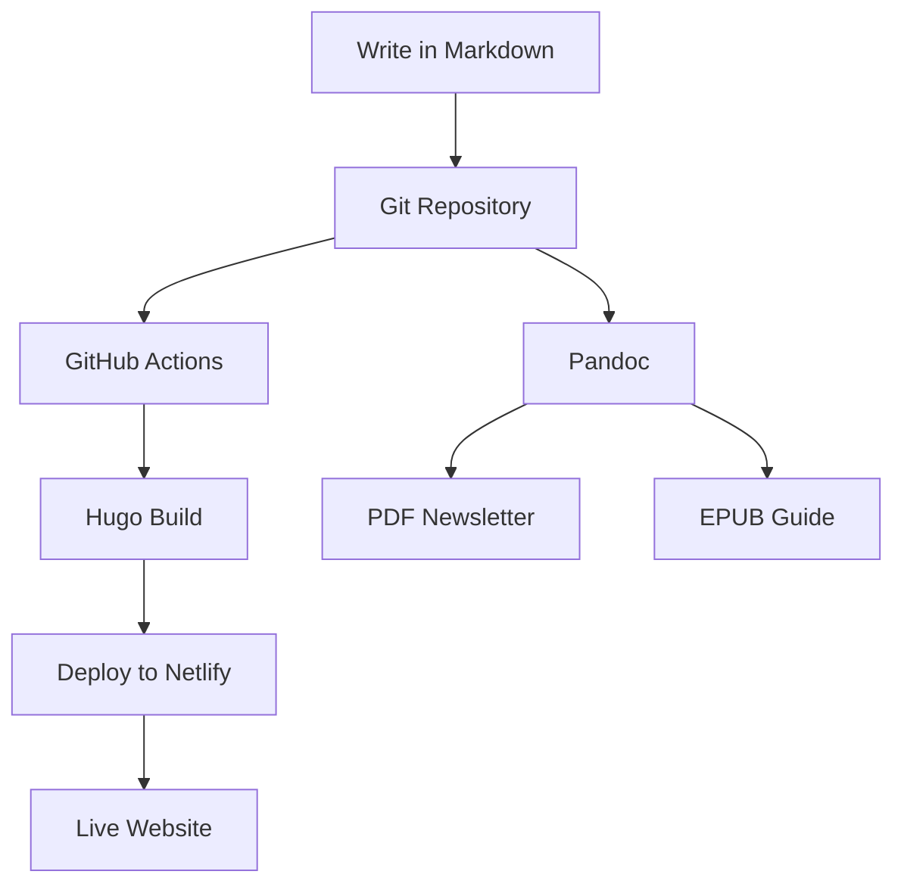
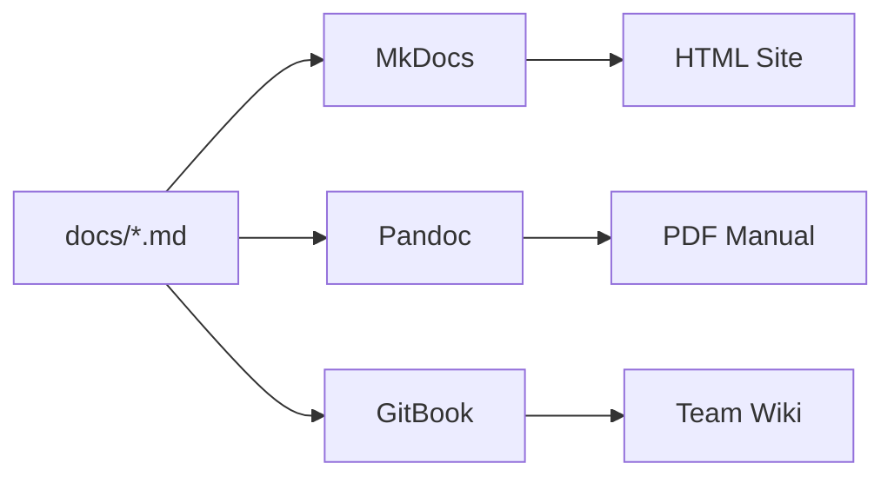
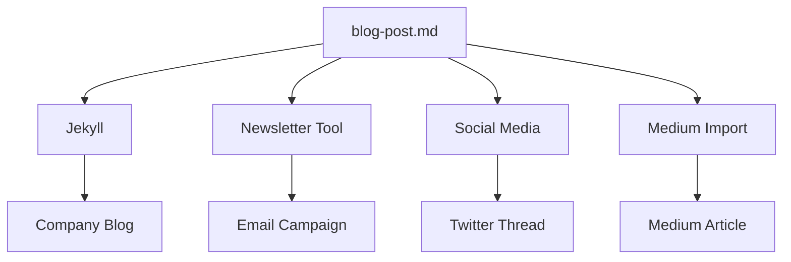

# Markdown as a Universal Format

Markdown isn't just a writing format – it's a **universal content format** that can transform into virtually any output you need.

## The Transformation Concept

Think of Markdown as the **source code** for your content:

```
Markdown (Source) → Parser → Output Format
```

### Single Source, Multiple Outputs

Write once in Markdown, generate:

- 📄 **PDF documents**
- 🌐 **HTML websites**
- 📱 **Mobile apps**
- 📧 **Email newsletters**
- 📊 **Presentations**
- 📚 **E-books**
- 📰 **Print materials**

## Popular Output Formats

### Web Formats

#### HTML

```markdown
# Hello World

This is **bold** text.
```

**Becomes:**

```html
<h1>Hello World</h1>
<p>This is <strong>bold</strong> text.</p>
```

#### Static Sites

- **Jekyll** → GitHub Pages
- **Hugo** → Lightning-fast sites
- **Gatsby** → React-powered sites
- **Next.js** → Full-stack applications

### Document Formats

#### PDF Generation

```markdown
# Technical Report

## Executive Summary

This document outlines...

## Data Analysis

| Metric  | Q1   | Q2   | Q3   | Q4   |
| ------- | ---- | ---- | ---- | ---- |
| Revenue | 100K | 120K | 135K | 150K |
```

**Transforms into professional PDF** with:

- Proper typography
- Table formatting
- Page breaks
- Headers/footers

#### Microsoft Word

Same Markdown content becomes `.docx` files with:

- Styled headings
- Formatted tables
- Proper spacing
- Corporate templates

### Presentation Formats

#### Slide Decks

```markdown
# Slide 1: Introduction

Welcome to our presentation

---

# Slide 2: Key Points

- Point one
- Point two
- Point three

---

# Slide 3: Conclusion

Thank you for your attention
```

**Becomes:**

- **reveal.js** HTML presentations
- **PowerPoint** slides
- **PDF** slide decks
- **Google Slides** import

### E-book Formats

#### EPUB Generation

```markdown
# Chapter 1: Getting Started

## Introduction

Welcome to the world of...

## Prerequisites

Before we begin, you'll need...
```

**Transforms into:**

- **EPUB** for e-readers
- **MOBI** for Kindle
- **PDF** for print

## Transformation Tools

### Universal Converters

#### Pandoc - The Swiss Army Knife

```bash
# Markdown to PDF
pandoc document.md -o document.pdf

# Markdown to Word
pandoc document.md -o document.docx

# Markdown to HTML
pandoc document.md -o document.html

# Markdown to LaTeX
pandoc document.md -o document.tex
```

#### GitBook

- Beautiful online documentation
- PDF export
- EPUB generation
- Team collaboration

### Specialized Tools

#### Academic Publishing

```markdown
# Research Paper Title

## Abstract

This study investigates...

## Introduction

Recent advances in [@citation2023]...

## Methodology

We employed a mixed-methods approach...
```

**Becomes:**

- **LaTeX** academic papers
- **PDF** with proper citations
- **HTML** with linked references
- **Word** for collaboration

#### Technical Documentation

````markdown
# API Reference

## Authentication

```http
GET /api/users
Authorization: Bearer {token}
```
````

## Response Format

```json
{
  "users": [{ "id": 1, "name": "John" }]
}
```

````

**Transforms into:**
- **Interactive API docs** (Swagger/OpenAPI)
- **Static documentation** sites
- **PDF** user manuals
- **Mobile** documentation apps

## Advanced Transformations

### Custom Styling

#### CSS for Web
```css
/* Custom styles for Markdown-generated HTML */
h1 { color: #2c3e50; }
blockquote {
  border-left: 4px solid #3498db;
  background: #f8f9fa;
}
````

### Template Systems

#### Hugo Templates

```html
<!-- layouts/_default/single.html -->
<article>
  <h1>{{ .Title }}</h1>
  <time>{{ .Date.Format "2006-01-02" }}</time>
  <div class="content">{{ .Content }}</div>
</article>
```

#### Jekyll Layouts

```html
---
layout: default
---

<div class="post">
  <h1>{{ page.title }}</h1>
  {{ content }}
</div>
```

## Real-World Transformation Examples

### Technical Blog Pipeline



### Documentation Workflow



### Content Marketing Pipeline



## Format-Specific Features

### Web-Optimized Features

```markdown
## <!-- SEO metadata -->

title: "Ultimate Guide to Markdown"
description: "Learn everything about Markdown"
keywords: ["markdown", "writing", "documentation"]

---

# Ultimate Guide to Markdown

Content with automatic:

- SEO optimization
- Social media previews
- Mobile responsiveness
- Fast loading times
```

### Print-Optimized Features

```markdown
<!-- Page breaks for PDF -->

# Chapter 1

Content...

\newpage

# Chapter 2

More content...

<!-- Print-specific styling -->

> **Print Note**: This appears differently in PDF vs web
```

## Best Practices for Multi-Format Content

### 1. Format-Agnostic Writing

Write content that works well in any format:

✅ **Good:**

```markdown
# Section Title

Brief introduction paragraph.

## Subsection

Detailed explanation with examples.
```

❌ **Problematic:**

```markdown
Click the button below (doesn't work in PDF)
See the sidebar (no sidebar in print)
```

### 2. Conditional Content

```markdown
<!-- Web-only content -->
<div class="web-only">
  [Interactive Demo](https://example.com/demo)
</div>

<!-- Print-only content -->
<div class="print-only">
  Visit https://example.com/demo for interactive version
</div>
```

### 3. Asset Management

```markdown
# Good - Works everywhere


# Better - Responsive


```

The beauty of Markdown is that you write once and can transform your content into **any format your audience needs** – making it the ultimate future-proof content format!
