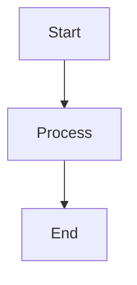
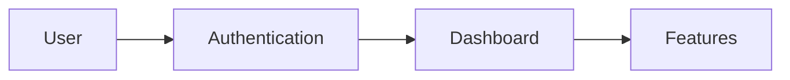

# Special Renderers

Markdown's power comes from its **extensibility**. Different renderers add unique features while maintaining the core Markdown syntax.

## What Are Special Renderers?

### The Concept

A Markdown renderer is software that converts Markdown text into other formats:

```
Markdown Text → Renderer → Output Format
```

### Why Different Renderers?

- **Different use cases** require different features
- **Platform-specific** needs and integrations
- **Extended functionality** beyond basic Markdown
- **Custom styling** and presentation options

## Popular Markdown Renderers

### Static Site Generators

#### Jekyll (GitHub Pages)

```yaml
# _config.yml
markdown: kramdown
kramdown:
  syntax_highlighter: rouge
  math_engine: mathjax
```

**Special Features:**

- Liquid templating
- Plugin system
- GitHub integration
- Custom collections

#### Hugo

```yaml
# config.yaml
markup:
  goldmark:
    renderer:
      unsafe: true
  highlight:
    style: github
    lineNos: true
```

**Special Features:**

- Extremely fast builds
- Shortcodes for custom content
- Built-in image processing
- Multi-language support

#### Gatsby

```javascript
// gatsby-config.js
module.exports = {
  plugins: [
    {
      resolve: `gatsby-transformer-remark`,
      options: {
        plugins: [`gatsby-remark-prismjs`, `gatsby-remark-images`],
      },
    },
  ],
};
```

**Special Features:**

- React component integration
- GraphQL data layer
- Progressive web app features
- Rich plugin ecosystem

### Documentation Platforms

#### GitBook

````markdown

This is an info callout box.





```javascript
console.log("Hello World");
```
````




```python
print('Hello World')
```




````

**Special Features:**
- Interactive content blocks
- Tabbed code examples
- Team collaboration
- Version control integration

#### Docusaurus
```markdown
:::tip Pro Tip
This is a tip callout using Docusaurus syntax.
:::

import Tabs from '@theme/Tabs';
import TabItem from '@theme/TabItem';

<Tabs>
  <TabItem value="js" label="JavaScript">
    ```js
    console.log('Hello');
    ```
  </TabItem>
  <TabItem value="py" label="Python">
    ```python
    print('Hello')
    ```
  </TabItem>
</Tabs>
````

**Special Features:**

- React component support
- Versioned documentation
- Search integration
- Internationalization

### Note-Taking Applications

#### Obsidian

````markdown
[[Link to another note]]
![[Embedded note]]


````

#tag1 #tag2

> [!NOTE]
> This is a special callout in Obsidian.

````

**Special Features:**
- Wiki-style linking
- Graph view of connections
- Plugin ecosystem
- Local file storage

#### Notion
```markdown
> 💡 Callout blocks with icons

/code - Insert code block
/table - Insert table
/image - Insert image

@mention users
[[Link to pages]]
````

**Special Features:**

- Database integration
- Rich media embedding
- Team collaboration
- Template system

## Renderer-Specific Extensions

### Mathematical Expressions

#### KaTeX/MathJax

```markdown
Inline math: $E = mc^2$

Block math:

$$
\int_{-\infty}^{\infty} e^{-x^2} dx = \sqrt{\pi}
$$
```

#### Mermaid Diagrams

````markdown

````

````

### Extended Syntax

#### Footnotes
```markdown
This text has a footnote[^1].

[^1]: This is the footnote content.
````

#### Task Lists

```markdown
- [x] Completed task
- [ ] Incomplete task
- [x] Another completed task
```

#### Definition Lists

```markdown
Term 1
: Definition 1

Term 2
: Definition 2a
: Definition 2b
```

## Choosing the Right Renderer

### Consider Your Needs

#### For Documentation

- **GitBook**: Team collaboration
- **Docusaurus**: Open source projects
- **VitePress**: Vue.js ecosystem
- **MkDocs**: Python projects

#### For Blogs

- **Jekyll**: GitHub Pages integration
- **Hugo**: Speed and performance
- **Gatsby**: React and GraphQL
- **Next.js**: Full-stack applications

#### For Note-Taking

- **Obsidian**: Local files and linking
- **Notion**: Team collaboration
- **Roam Research**: Networked thought
- **Logseq**: Open source alternative

### Feature Comparison

| Renderer   | Speed     | Plugins   | Learning Curve | Use Case       |
| ---------- | --------- | --------- | -------------- | -------------- |
| Jekyll     | Medium    | High      | Medium         | GitHub Pages   |
| Hugo       | Very Fast | Medium    | Medium         | Static sites   |
| Gatsby     | Fast      | Very High | High           | React apps     |
| Docusaurus | Fast      | Medium    | Low            | Documentation  |
| GitBook    | Medium    | Low       | Very Low       | Team docs      |
| Obsidian   | Fast      | Very High | Medium         | Personal notes |

## Custom Renderer Development

### Basic Renderer Structure

```javascript
// Simple Markdown to HTML renderer
class CustomRenderer {
  constructor() {
    this.rules = {
      heading: /^(#{1,6})\s+(.+)$/gm,
      bold: /\*\*(.*?)\*\*/g,
      italic: /\*(.*?)\*/g,
      link: /\[([^\]]+)\]\(([^)]+)\)/g,
    };
  }

  render(markdown) {
    let html = markdown;

    // Apply transformation rules
    html = html.replace(this.rules.heading, (match, hashes, text) => {
      const level = hashes.length;
      return `<h${level}>${text}</h${level}>`;
    });

    html = html.replace(this.rules.bold, "<strong>$1</strong>");
    html = html.replace(this.rules.italic, "<em>$1</em>");
    html = html.replace(this.rules.link, '<a href="$2">$1</a>');

    return html;
  }
}
```

### Plugin Architecture

```javascript
// Plugin system example
class MarkdownProcessor {
  constructor() {
    this.plugins = [];
  }

  use(plugin) {
    this.plugins.push(plugin);
    return this;
  }

  process(markdown) {
    return this.plugins.reduce((content, plugin) => {
      return plugin(content);
    }, markdown);
  }
}

// Custom plugin
const emojiPlugin = (markdown) => {
  return markdown.replace(/:smile:/g, "😊");
};

// Usage
const processor = new MarkdownProcessor().use(emojiPlugin).use(otherPlugin);
```

## Best Practices

### 1. Choose Based on Requirements

- **Performance**: Hugo for speed
- **Ecosystem**: Gatsby for React
- **Simplicity**: Jekyll for basics
- **Features**: Obsidian for notes

### 2. Consider Long-term Maintenance

- **Community size** and activity
- **Documentation** quality
- **Update frequency**
- **Migration difficulty**

### 3. Test Before Committing

- **Prototype** with sample content
- **Test** all required features
- **Evaluate** performance
- **Check** export options

## Migration Between Renderers

### Content Portability

````markdown
<!-- Standard Markdown works everywhere -->

# Heading

**Bold text**
[Link](url)

<!-- Renderer-specific features may need conversion -->
<!-- Jekyll liquid tags -->


code here


<!-- Convert to standard code blocks -->

```javascript
code here
```
````

```

### Migration Strategies
1. **Audit** current content for renderer-specific features
2. **Create** conversion scripts for custom syntax
3. **Test** content in new renderer
4. **Update** build processes and deployment

Special renderers **extend Markdown's capabilities** while maintaining its simplicity – choose the one that best fits your workflow and requirements!
```
